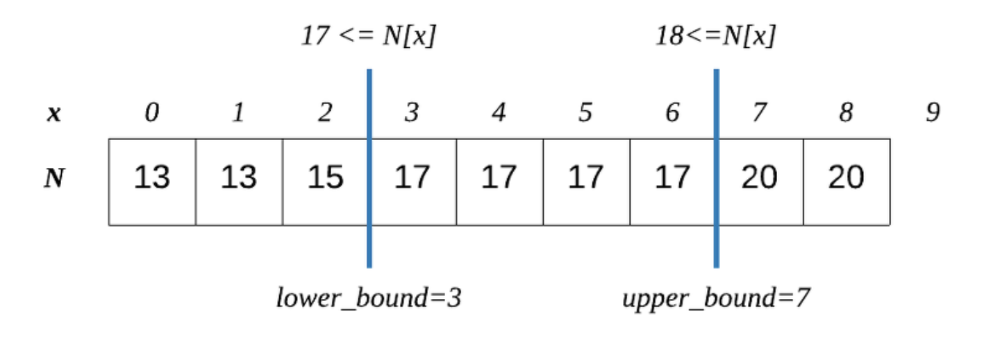
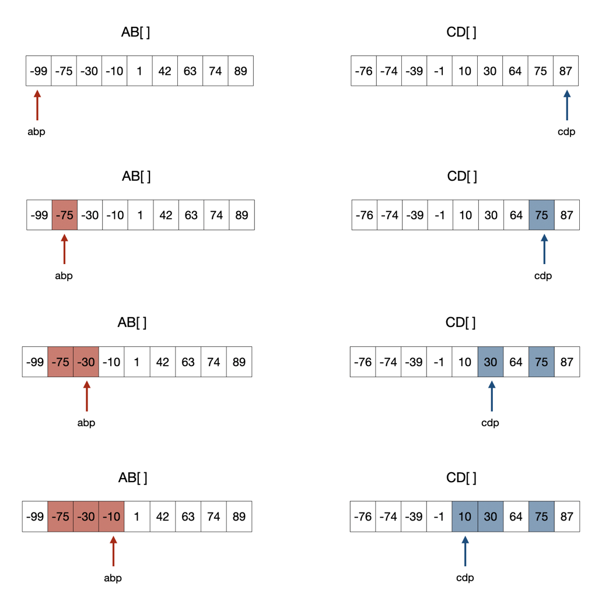
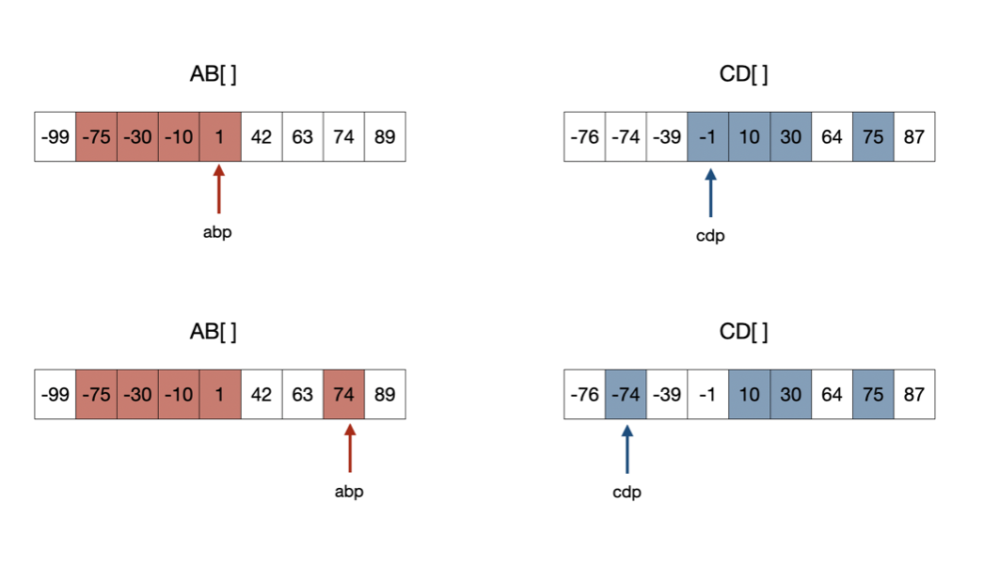

# 이분탐색 정리
## 자바에서의 이분탐색
- 자바에서는 Arrays.binarysearch 함수를 이용하여 쉽게 이분탐색 할 수 있음
- 형태 : Arrays.binarysearch(array, left, right, key)

### lower bound, upper bound

어떤 리스트에서 이분탐색을 이용해서 특정 값을 찾을때, 리스트가 중복된 값을 포함하고 있을 수 있다. 그 중복값을 전부 찾거나 또한 그 중복값들을 활용해서 문제를 해결하는 문제를 위해서 upper_bound나 lower_bound가 존재한다.

- lower bound
    - 범위 (begin, end) 안의 원소들 중, 특정 target보다 크거나 같은 첫번째 원소의 인덱스를 리턴한다. 만약 그런 원소가 없다면 end 인덱스를 리턴한다. 이때 리스트는 모두 정렬된 상태여야 한다. 즉, lower_bound가 성립하기 위해서는 각각의 요소들중 element < target를 만족하는 요소들은 만족하지 않는 요소들보다 앞에 있어야한다.

- upper bound
  - 범위 [begin, end) 안의 원소들 중, 특정 target보다 큰 첫번째 원소의 인덱스를 리턴한다. 만약 그런 원소가 없다면 end 인덱스를 리턴한다. 이때 리스트는 모두 정렬된 상태여야 한다. 즉, upper_bound가 성립하기 위해서는 각각의 요소들중 element <= target를 만족하는 요소들은 만족하지 않는 요소들보다 앞에 있어야한다. lower_bound와 비교해보면 등호가 들어가는데, target보다 큰 인덱스를 구하기 위해서이다. 

### 투 포인터

- 설계
  - 1. a,b,c,d를 ab, cd배열로 압축시킨다.
    2. ab와 cd배열을 정렬한 후 이진탐색을 통해 합이 0이 되는 지점을 탐색한다.
       - abv+cdv <0, 값을 올려야 하므로 ab포인터가 한 칸 앞으로 이동한다. abp+=1;
       - abv+cdv >0, 값을 내려야 하므로 cd포인터가 한 칸 뒤로 이동한다. cdp-=1;
       - abv+cdv=0, 0이 되는 구간이므로 중복되는 원소가 있는지 확인한 후 카운트를 해준다.
    3. ab포인터가 n*n이 되거나 cd포인터가 -1이 되는 순간 탐색을 종료한다. 

이분 탐색 문제는 전혀 감을 못잡아서 문제를 좀 더 풀어봐야 감이 잡힐 듯...

참고
https://velog.io/@junhok82/lowerbound-upperbound -> lower bound/ upper bound
https://steady-coding.tistory.com/326 -> 7453 풀이 참고
https://loosie.tistory.com/553 -> 투포인터
https://pbg0205.tistory.com/80 -> 투포인터 

